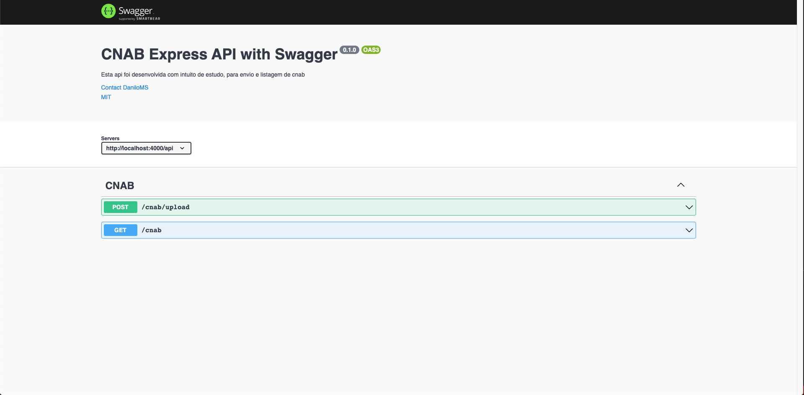

# CNAB Parse

## _Projeto simplificado que procura importar um documento cnab e gerar uma lista do mesmo no banco de dados_

[](https://travis-ci.org/joemccann/dillinger)

O projeto é dividido em duas partes backend e frontend

## Utilizando

> `ATENÇÃO`
> Esta api foi desenvolvida para fazer conexão com um banco de dados [MySQL](https://www.mysql.com/) onde o mesmo já deve existir e estar pronto para acesso. Os dados de conexão devem ser informados no arquivo [config/adress.js](https://github.com/danilosoftwares/desafio-dev/blob/main/Backend/config/adress.json). Não é necessario que este banco de dados tenha dentro dele um database especifico, pois isso será gerado automaticamente pela api ao ser iniciada.

Ao localizar a pasta do projeto **desafio-dev** você deve executar o comando abaixo:

```sh
cd backend
npm i
npm start
```

Após executar já será possivel utilizar a api no url http://localhost:4000


Também será possível acessar a documentação da api atraves da ferramenta swagger no url http://localhost:4000/api-docs/



# Backend

Essencialmente o backend tem como objetivo gerar um banco de dados baseado numa modelagem já definida e tambem gerar endpoints para acesso dos dados, fazendo a interação do front com o banco de dados.

Porta utilizada para api **4000**

**Execução**

```sh
cd backend
npm i
npm start
```

**Tecnologias utilizadas:**

- [NodeJS](https://nodejs.dev/)
- [Sequelize](https://sequelize.org/)
- [Swagger](https://www.npmjs.com/package/swagger-ui-express)
- [MySQL](https://www.mysql.com/)

**Endpoints gerados pela api:**

| Tipo | URL              | O que faz                                                                            |
| ---- | ---------------- | ------------------------------------------------------------------------------------ |
| GET  | /api/cnab        | Retorna todos os registros dos cnab's gravados no banco                              |
| POST | /api/cnab/upload | Envia para api todos os arquivos cnab para tratamento do mesmo pela api              |
| GET  | /api-docs        | Retorna a documentação da api e permite a interação atraves da ferramenta de swagger |

**Banco de dados:**

Esta api já gera todas as tabelas necessarias para o bom funcionamento da ferramenta, todavia a mesma necessita de um banco de dados préviamente pronto, onde o mesmo será acessado e utilizado pelo backend.
Para a configuração de acesso do banco de dados é necessário preencher os dados do banco de dados no arquivo [config/adress.js](https://github.com/danilosoftwares/desafio-dev/blob/main/Backend/config/adress.json) para o bom funcionamento.
**Obs: Esta api foi desenvolvida para utilizar um banco de dados do tipo [MySQL](https://www.mysql.com/).**

# Frontend

Essencialmente o frontend tem como objetivo permitir ao usuario final ter de forma visual e fácil a interação com os dados contidos no arquivo cnab. Existem duas rotinas que são executadas no frontend, enviar e listar os dados cnab.

**Compilação**

```sh
cd frontend
npm i
npm run build
```

**Tecnologias utilizadas:**

- [ReactJS](https://pt-br.reactjs.org/)
- [Axios](https://axios-http.com/docs/intro)
- [Styled-Components](https://styled-components.com/)

## License

MIT
